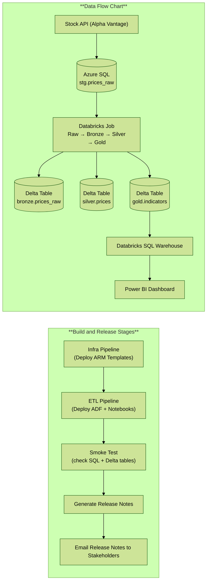

# Architecture Diagram

# StockETFAnalyticsPipeline
This repo contains an end‑to‑end starter for the Stock &amp; ETF Analytics Platform with Azure Key Vault for secrets, ARM-based IaC, ADF ingestion, Databricks (Unity Catalog) transforms, and DevOps CI/CD.

## Prerequisites

- Azure subscription with permission to assign RBAC on the target RGs
- Azure DevOps project connected to this GitHub repo
- Resource groups:
  - `dev-analytics-finance`
  - `prod-analytics-finance`
- (Recommended) AAD groups:
  - `sql-admins-analytics-dev`
  - `sql-admins-analytics-prod`

## Quick Start

## Quick Start/ToDo
1. Fork/clone this repo. Create an Azure DevOps project and connect to your GitHub repo.
2. Create a Service Connection (**_ServiceConnectionDevProd_** to match example pipeline) to your Azure subscription (ARM service connection). Grant it *Owner* at the RG scope for initial setup.
3. Edit `/infra/arm/parameters.dev.json` to set names/region.
4. In Azure DevOps, run `pipelines/azure-pipelines-infra.yml` (it will create the RG, Storage, SQL, ADF, and Databricks).
5. Put secrets into Key Vault **after** deployment:
   - `ALPHAVANTAGE_API_KEY` = your API key
   - `SQL_ADMIN_PASSWORD` = the SQL admin password you set in parameters
6. In ADF, publish the provided linked services/datasets/pipeline (the ETL pipeline also has a step to ARM-deploy them).
7. Run `pipelines/azure-pipelines-etl.yml` to import notebooks, create a Key Vault–backed secret scope in Databricks, and trigger the job.
8. (Optional) Connect Power BI to the Databricks SQL Warehouse and build visuals.

## Key Vault Integration
- ADF uses an **AzureKeyVault** linked service to resolve `@Microsoft.KeyVault()` references in other linked services.
- Databricks uses a **Key Vault–backed secret scope** named `kv-secrets`. We map secret names 1:1 (e.g., `ALPHAVANTAGE_API_KEY`).

## Costs & Limits
- Alpha Vantage free tier: 5 requests/min, 500/day. Use a small ticker list for demos.
- Azure costs are minimal at dev SKUs; shut down clusters when not in use.

## Ticker List
Set default tickers in `adf/pipelines/ingest_prices.json` parameter `tickers` (comma‑separated). Example: `AAPL,MSFT,NVDA,SPY,QQQ`.

## Next Steps
- Add ETF holdings ingestion (e.g., SPY/QQQ holdings) into bronze -> silver -> gold.
- Add Power BI pbix and CI for semantic model.
