# Architecture Diagram

```mermaid
---
config:
      theme: forest
---
graph LR
 subgraph BUILD[**Build and Release Stages**]
    INFRA["Infra Pipeline<br/>(Deploy ARM Templates)"] --> ETL["ETL Pipeline<br/>(Deploy ADF + Notebooks)"]
    ETL --> TEST["Smoke Test<br/>(check SQL + Delta tables)"]
    TEST --> RELNOTE[Generate Release Notes]
    RELNOTE --> EMAIL[Email Release Notes to Stakeholders]
 end

 subgraph **Data Flow Chart**
  API["Stock API (Alpha Vantage)"] --> SQL[("Azure SQL<br/>stg.prices_raw")]
  SQL --> DBXJOB[Databricks Job<br/> Raw → Bronze → Silver → Gold]
  DBXJOB --> BRZ[(Delta Table<br/>bronze.prices_raw)]
  DBXJOB --> SLV[(Delta Table<br/>silver.prices)]
  DBXJOB --> GLD[(Delta Table<br/>gold.indicators)]
  GLD --> DSQL[Databricks SQL Warehouse]
  DSQL --> PBI[Power BI Dashboard]
 end

```

# StockETFAnalyticsPipeline
This repo contains an end‑to‑end starter for the Stock & ETF Analytics Platform with Azure Key Vault for secrets, ARM-based IaC, ADF ingestion, Databricks (Unity Catalog) transforms, and DevOps CI/CD.

## Prerequisites

- Azure subscription with permission to assign RBAC on the target RGs
- Azure DevOps project connected to this GitHub repo
- Resource groups:
  - `dev-analytics-finance`
  - `prod-analytics-finance`
  - you can run the following AZ command to create the resource group:`az deployment group create --name deploy-analytics-dev --resource-group dev-analytics-finance --template-file infra/arm/rgs.resources.json --parameters @infra/arm/rgs.resources.parameters.dev.json`
- (Recommended) AAD groups:
  - `sql-admins-analytics-dev`
  - `sql-admins-analytics-prod`

## Quick Start

## Quick Start/ToDo
1. Fork/clone this repo. Create an Azure DevOps project and connect to your GitHub repo.
2. Create a Service Connection (**_ServiceConnectionDevProd_** to match example pipeline) to your Azure subscription (ARM service connection). Grant it *Owner* at the RG scope for initial setup.
3. Edit `/infra/arm/parameters.dev.json` to set names/region.
4. In Azure DevOps, run `pipelines/azure-pipelines-infra.yml` (it will create the RG, Storage, SQL, ADF, and Databricks).
5. Put secrets into Key Vault **after** deployment:
   - `ALPHAVANTAGE_API_KEY` = your API key
   - `SQL_ADMIN_PASSWORD` = the SQL admin password you set in parameters
6. In ADF, publish the provided linked services/datasets/pipeline (the ETL pipeline also has a step to ARM-deploy them).
7. Run `pipelines/azure-pipelines-etl.yml` to import notebooks, create a Key Vault–backed secret scope in Databricks, and trigger the job.
8. (Optional) Connect Power BI to the Databricks SQL Warehouse and build visuals.

## What the infra template deploys
`infra/arm/rgs.resources.json` (parameters: infra/arm/rgs.resources.parameters.<env>.json)
- Storage (StorageV2, HNS enabled)
- SQL Server + Database
   - Server AAD admin = your AAD group (e.g., sql-admins-analytics-dev)
   - Database = Serverless (General Purpose / Gen5) with:
   - Max vCores 2, Min vCores 0.5
   - Auto-pause 60 min
   - Backup redundancy: LRS

- Azure Data Factory
- Azure Databricks workspace (default/managed VNet)

**Cost tip**: A Databricks workspace with a managed VNet may create a NAT Gateway in a managed RG (Databricks-owned). If you aren’t using Databricks yet, delete the workspace to stop that cost and recreate later with your preferred networking.

## Pipeline (CI/CD)
**Primary pipeline:** `pipelines/azure-pipelines-infra-core.yml`
Templates:
- `pipelines/templates/whatif.steps.yml`
- `pipelines/templates/sql.run.steps.yml`

**Triggers**
- PRs (any branch) that change `infra/arm/**` or `pipelines/**` → run Dev What-If only
- Push to `main` (same paths) → run Dev What-If → Dev Deploy → Prod (gated)

**Stages**
1. PR_WhatIf_Dev
- Runs az deployment group what-if on dev
- Validates JSON and fails on Deletes (delete guard)
- Publishes whatif/dev-analytics-finance.json as a pipeline artifact

2. Main_Dev (on `main`)
- Dev_WhatIf → same guard + artifact
- Dev_Deploy → applies ARM to Dev (`az deployment group create`)
- Dev_DB_Schema → runs `infra/sql/01_create_stg_prices_raw.sql` against Dev using AAD token auth

3. Prod (on `main`, after Main_Dev Succeeded)
- Prod_Gated (Environment `prod-infra`) → approval → Prod What-If (guard + artifact) → Prod Deploy
- Prod_DB_Schema → runs the same SQL against Prod

**Artifacts**
What-If outputs are stored under whatif/ and published so reviewers can download them from the run’s Summary → Artifacts.

## SQL authentication & authorization
**Server AAD admin (group)**
ARM sets the SQL Server’s AAD admin to:
- Dev: sql-admins-analytics-dev
- Prod: sql-admins-analytics-prod
Members of that group can log in with AAD and administer DBs on that server. In my dev I have added my service principal for my service connection as part of both groups, which allows it to run DDL/DML. However, an approach of `least priviledge` is advised for production environments. 

## Key Vault Integration
- ADF uses an **AzureKeyVault** linked service to resolve `@Microsoft.KeyVault()` references in other linked services.
- Databricks uses a **Key Vault–backed secret scope** named `kv-secrets`. We map secret names 1:1 (e.g., `ALPHAVANTAGE_API_KEY`).

## Costs & Limits
- Alpha Vantage free tier: 5 requests/min, 500/day. Use a small ticker list for demos.
- Azure costs are minimal at dev SKUs; shut down clusters when not in use.

## Ticker List
Set default tickers in `adf/pipelines/ingest_prices.json` parameter `tickers` (comma‑separated). Example: `AAPL,MSFT,NVDA,SPY,QQQ`.

## 🧩 Azure Data Factory CI/CD

This project uses the **`adf_publish`** deployment approach for Azure Data Factory (ADF).

### How It Works
- All ADF pipelines, datasets, and linked services are authored in **ADF Studio**.
- When you click **Publish** in ADF Studio (Dev environment), Azure generates a deployable ARM template in: /adf/adf_publish/
- The `adf_publish` folder contains:
   - `ARMTemplateForFactory.json`
   - `ARMTemplateParametersForFactory.json`
- The CI/CD pipeline in `/pipelines/azure-pipelines-adf.yml` triggers automatically whenever changes occur in that folder.
- It deploys the published ADF configuration to the target environment.

### Why I am Using This Approach
✅ Microsoft-recommended pattern for ADF CI/CD  
✅ Automatically handles dependencies between datasets, linked services, and pipelines  
✅ Environment parameters can be overridden in the pipeline  
✅ No need to manually publish in each environment — only publish from Dev once  

In summary: **Publish once from Dev → Pipeline deploys everywhere.**

## Next Steps
- Add ETF holdings ingestion (e.g., SPY/QQQ holdings) into bronze -> silver -> gold.
- Add Power BI pbix and CI for semantic model.

